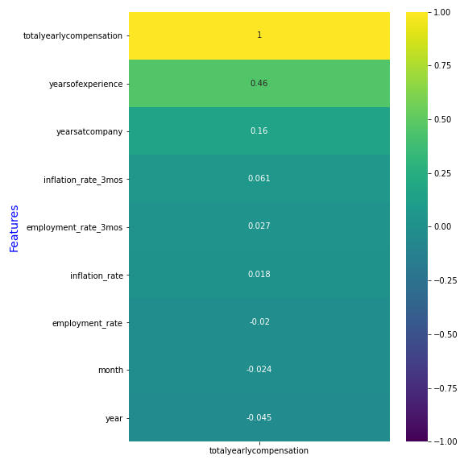
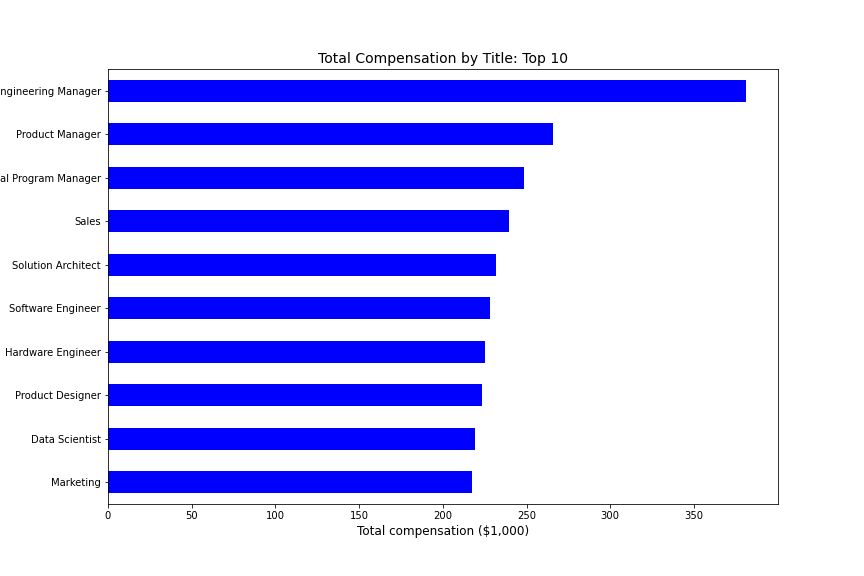
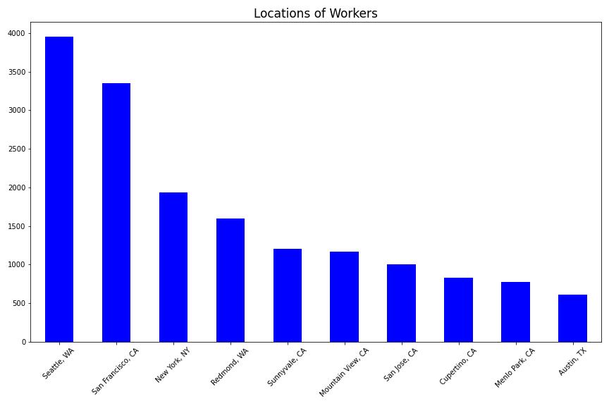
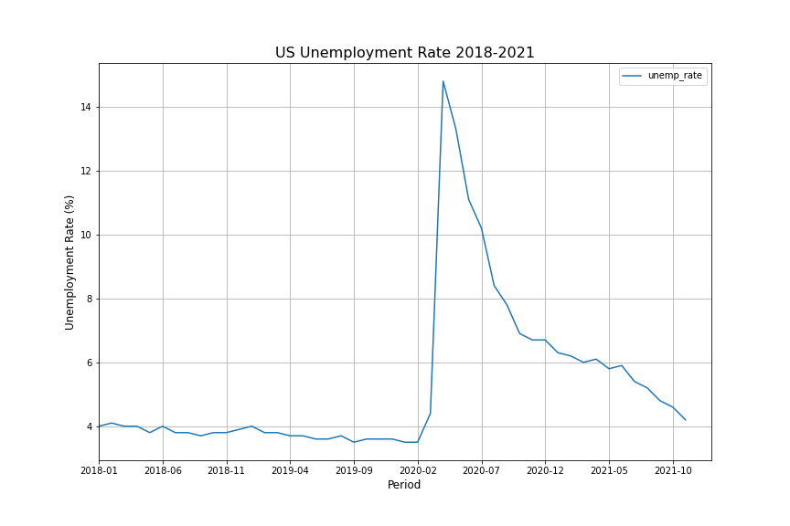

# Group-Project, Data Science Immersive at General Assembly
## Project 5: Predicting employee total compensation

**Authors:**
* Annie Wang
* Hans Baumberger
* Mason Lee
* Sileshi Hirpa

## Content of the Project:
  * ### Problem statement
  * ### Data cleaning and EDA
  * ### Data Preprocessing and Modeling
  * ### Model Selection
  * ### Next Steps

### **Problem statement:**
Predict the total compensation for a prospective employee based on the professional background, companies and their locations, and macroeconomic  factors.
* Goals
  1. Provide a reasonable expectation for compensation negotiation
  2. Provide an important benchmark to the companies for competitive compensation package in recruitment.

The technical goal for our project is to maximize **R^2** and minimize **MSE**. 

* ### Data cleaning and EDA

Our project is based on the datasets obtained from:
1. Web scraping the Levels.fyi (which lets users compare career levels and compensation packages across different companies) with permission from the administration.
2. Inflation rate from [rateinflation.com](https://www.rateinflation.com/inflation-rate/usa-inflation-rate/)
3. Unemployment data from [Data World](https://data.world/vizwiz/employment-unemployment-by-state-and-month/workspace/file?filename=BLS+Monthly+Unemployment+Rate.xlsx).

The three datasets were merged after data cleaning and EDA.

## Data Dictionary

|Term|Description|
|--|--|
|timestamp|timestamp of compensation record submission|
|company|company names |
|title|employee's job title|
|totalyearlycompensation|total compensation that an employee gets annually|
|location|cities where the companies are located|
|yearsofexperience|years of experience in a career|
|yearsatcompany|experience years of an employee at a particular company |
|year|year of timestamp|
|month|month of timestamp|
|year_month|year month of the data|
|inflation_rate|the percentage at which a currency is devalued during a period|
|inflation_rate_3mos|inflation rate of 3 months prior to record timestamp|
|state|states in the US|
|employment_rate|The percentage of the labor force that is employed|
|employment_rate_3mos|employment rate of 3 months prior to record timestamp|

* Some of the EDA we used include:

1. Features' correlation  
      

2. Top 10 total compensations by title

      

3. Workers' location (top 10)

      

4. Nationwide Inflation Rate

    

5. Nationwide Unemployment Rate

* ### Model Performance

Most of our models took longer than anticipated amount of time during the hyperparameter tuning process and we decided to run a model (RandomForestRegression) on the AWS platform. 
The following table summarizes the models we evaluated and the best model the team agreed upon for the compensation preidction: Gradient Boosting Regressor (with GridSearch).

|**Model**|**Training Score (R^2)**|**Testing Score(R^2)**|**MSE(Train)**|**MSE(Test)**|*Comment*|
|--|--|--|--|--|--|
|**Linear Regression(with no penality)**|0.5193|-7.2931Xe^28|8286.35|1.22Xe^27||
|**Lasso Regularization (CV)**|0.5182|0.5143|8305.30|8157.45||
|**Ridge Regularization (CV)**|0.52|0.5097|8274.20|8234.28||
|**Elastic Net  Regularization (CV)**|0.4483|0.4499|9511.19|9238.88||
|**Random Forest Regression (with Gridsearch)**|0.466|0.410|9060|10319||
|**KNN Regressor (with Gridsearch)**|0.9907|0.4762|158.35|9172.55||
|**Gradient Boosting Regressor (no gridsearch)**|0.5973|0.5318|6834.12|8198.40||
|**Gradient Boosting Regressor (with gridsearch)**|0.7131|0.5477|4867.52|7919.98|Best Model|
|**Support Vector Regression (SVR) (without gridsearch)**|0.1368|-0.1287|||
|**Support Vector Regression (SVR) (with Gridsearch)**|0.5029|0.4745|||
|**AdaBoost (with Gridsearch)**|0.1930|0.1276|13693|15276||

### Next Steps
* Incorporate more personal background features of the employee into analysis (i.e. Education)
* Incorporate more company and industry background information (i.e. Stock price, Company size, Industry sector)
* Include current data (after Sep. 2020)
* More hyperparameter tuning (GridSearch, RandomizedSearch, BayesSearch)
